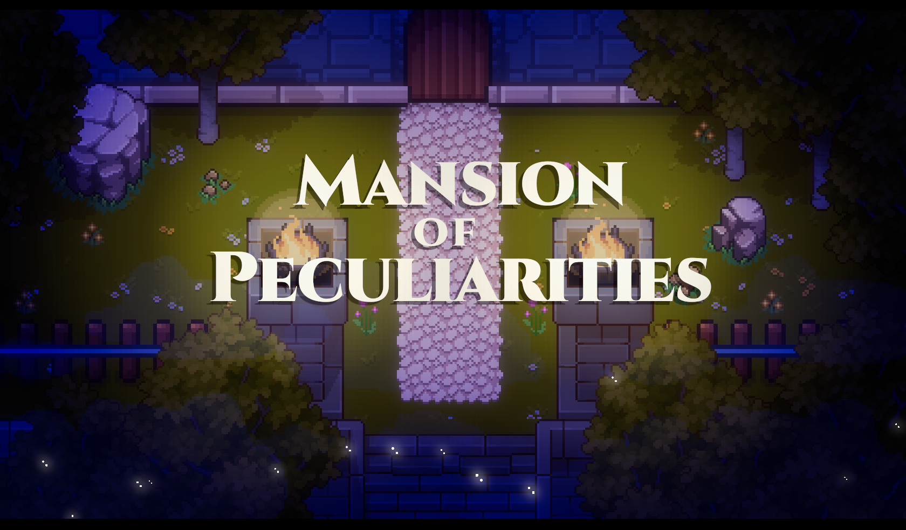
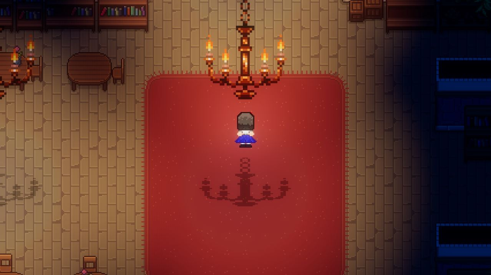
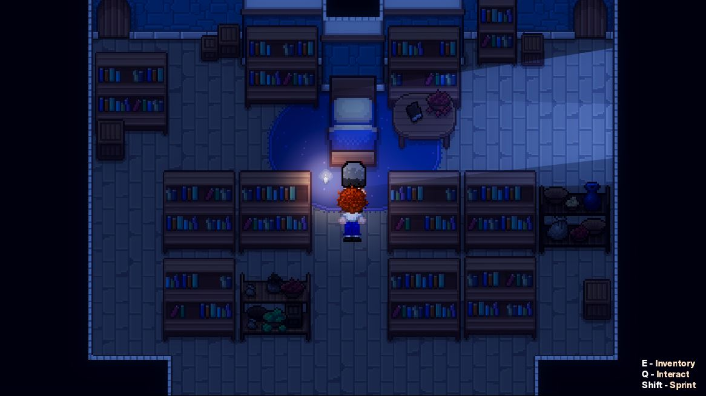
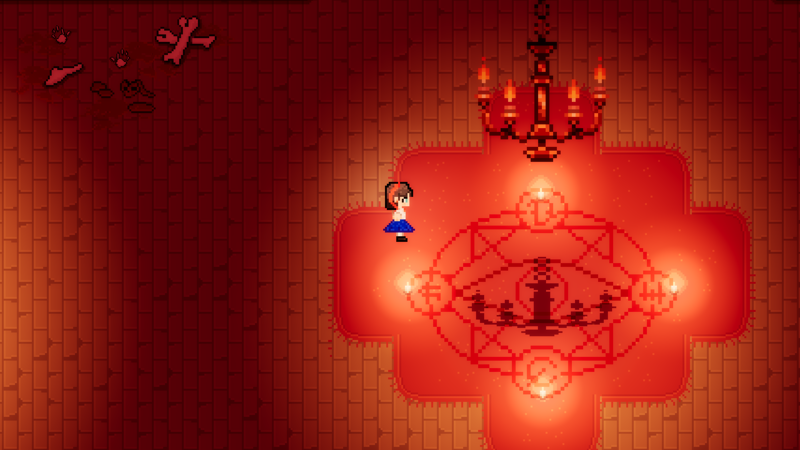

# Mansion of Peculiarities

A 2D horror puzzle adventure built in Godot Engine. Explore a mansion, uncover its secrets, and piece together a mystery tied to your own forgotten past.



## Overview

Mansion of Peculiarities is a 2D horror puzzle game developed as a capstone project. Players explore an unsettling mansion, interact with entities and puzzle mechanics, and progress through a save-based, event-driven story that unfolds through exploration and environmental storytelling.

**Play it on itch.io:** [edjaydev.itch.io/mansion-of-peculiarities](https://edjaydev.itch.io/mansion-of-peculiarities)

## Features

- **2D horror puzzle exploration** — built with Godot Engine and GDScript, focused on environmental storytelling and atmosphere.
- **Custom pixel-art animation** — 5-frame sprite animations for entities and interactive UI elements, including bounded text rendering for a "save book" state manager.
- **Structured level and progression design** — planned pacing across levels, balancing exploration, puzzle difficulty, and story beats.
- **Event-driven systems** — scripted gameplay logic, tilemaps, animation systems, and interactive environments that respond to player actions.

## Screenshots

|                                                    |                                                 |                                              |
| -------------------------------------------------- | ----------------------------------------------- | -------------------------------------------- |
|  |  |  |

## Tech Stack

- **Engine:** Godot Engine
- **Scripting:** GDScript
- **Art:** Custom pixel-art sprites and tilemaps, 5-frame animation cycles

## Getting Started

### Prerequisites

- [Godot Engine](https://godotengine.org/) (version matching the project's `project.godot` file)

### Running the project

1. Clone the repository
   ```bash
   git clone https://github.com/EdjayDev/MansionOfPeculiarities.git
   ```
2. Open Godot Engine and import the project via **Project > Import**, selecting the cloned folder.
3. Run the project from the Godot editor, or export a build for your target platform.

## Credits

| Role                      | Contributor                                       |
| ------------------------- | ------------------------------------------------- |
| Development & programming | [EdjayDev](https://github.com/EdjayDev)           |
| Concept design & art      | [Charm-Zel1412](https://github.com/Charm-Zel1412) |

## License

This project is available for educational and portfolio reference purposes.
